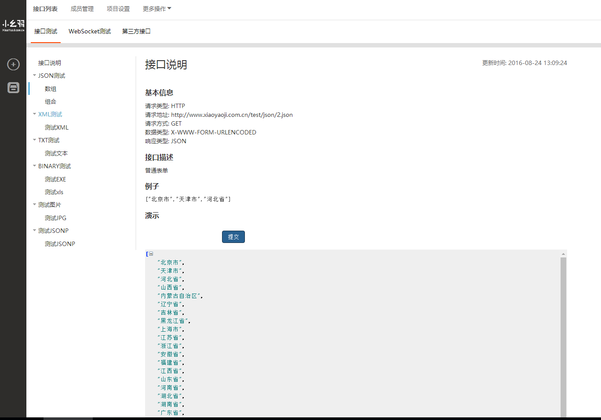
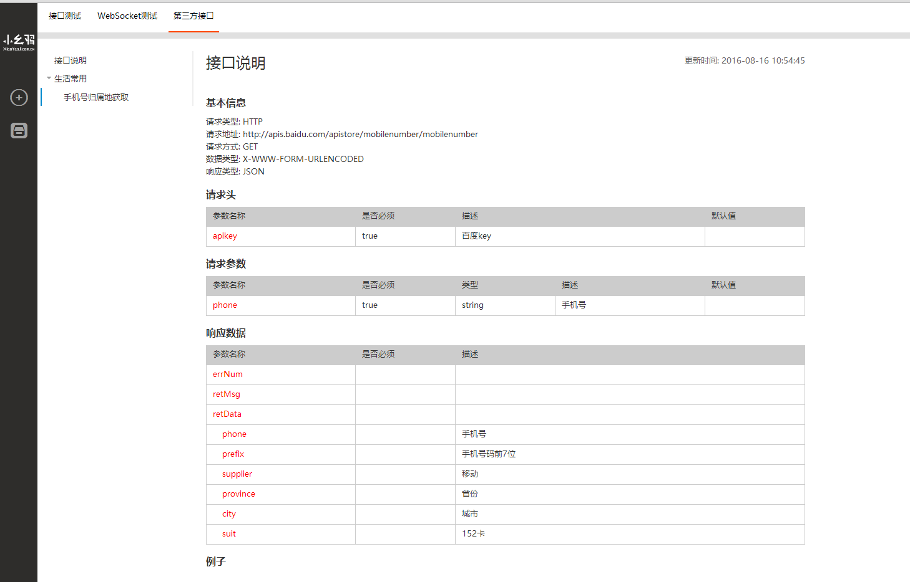
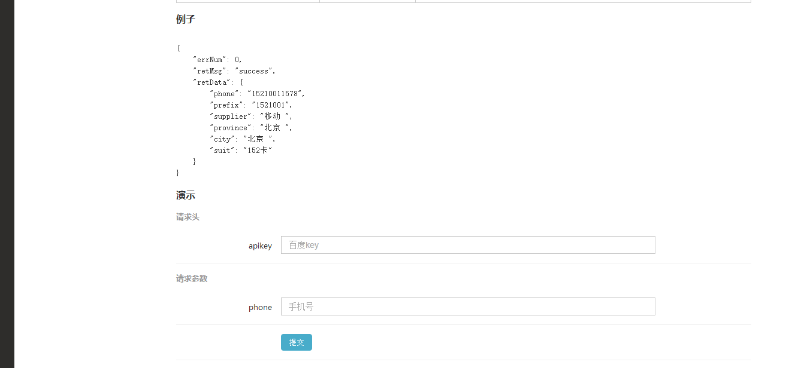
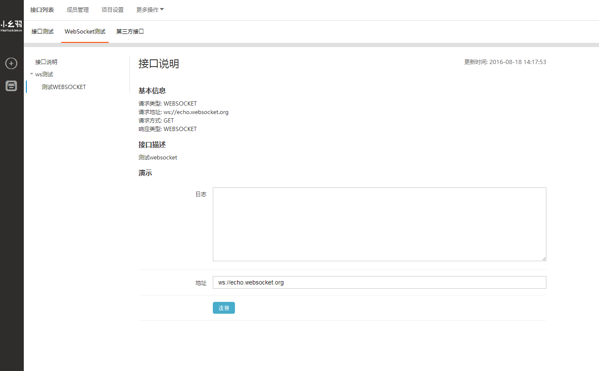

# 小幺鸡接口管理页面
   

### 特点
   * 在线接口测试 目前支持 json,text,html,xml,jsonp,Websocket
   * markdown编辑器

### [在线demo](http://www.xiaoyaoji.com.cn/) （推荐使用在线系统）
	
## 文件夹说明
* web 文件夹是前端静态页面 基于nodejs，webpack gulp，vuejs,jqueryjs开发完成
* api 使用java开发，运行在tomcat7.x以上版本。maven，druid，mariadb

## 兼容性
* 静态页系统暂时只兼容chrome，其他浏览器未测试。
* 后端：jdk1.7 tomcat7  mariadb5.5

## 使用说明
### 文件夹说明
 api : 接口
 web : 静态页面
    - extension:浏览器扩展
    - config.js 一些页面配置
    - gulp.js   gulp构建器
    - html 网页源码
    - package.json 
    - webpack.config.js webpack配置
##开发版本
### API
 * api/src下面为源码，基于maven项目构建。
 * 修改api/src/main/resources/config.properties 中的数据库配置信息，
    * 如果需要使用第三方登录,需要配置对应的地址
    * 如果需要使用邮件发送,需要配置sendcloud邮箱配置信息
    * config.properties未单独做中文编码处理，为防止乱码，中文需要改为unicode
 * 导入api/sql/xiaoyaoji.sql 文件导入到mysql中，
 * 启动tomcat，浏览器运行 http://localhost:端口/api/index.html 能正常显示Hello XiaoYaoJi API 则表示可用。
 
#### API 依赖jar  org.mangoframework.core 1.2.3
     项目及使用说明都在这：http://git.oschina.net/zhoujingjie/mangoframework
     或者直接下载附件中的jar
### WEB
  * npm install 下载项目依赖包 
  * npm run watch 编译并且监听文件改动
  * npm run server 运行开发项目-文件夹 (用于开发过程中)
  * 浏览器访问http://localhost:8080/ 可以看到正在开发中的项目

  * npm run build 编译项目,并且生成built文件夹
  * gulp 将built文件夹及html文件夹代码打包到dist文件夹中;
  * npm run dist-server 运行dist文件夹下的项目(也就是编译后的项目,一般用于上线前最后测试。)
  * 浏览器访问http://localhost:8080/ 可以看到编译打包后的项目

  * 修改html/assets/js/config.js配置
      * window.root : 接口地址
      * window.ctx : 静态页面相对路径

### 直接使用

   *  下载https://git.oschina.net/zhoujingjie/apiManager/tree/master/releases 中的最新版本的zip包(之前是放在附件中，附件上传速度太慢改为这了)
   * 包里面文件夹有
      *  api: 接口
      *  html: 静态页面
### 需要修改的地方
#### API
    * 导入api/sql/xiaoyaoji-MMdd.sql 到mysql中。mysql需要5.5以上
    * 修改api/WEB-INF/classes/config.properties中的数据库配置信息。
    * 如果需要使用第三方登录,需要配置对应的地址
    * 如果需要使用邮件发送,需要配置sendcloud邮箱配置信息
#### WEB
    * 复制html内容到本地服务器中根目录，修改 /assets/js/config.js 里面的window.root的地址为你部署api后的访问地址

### 效果

    